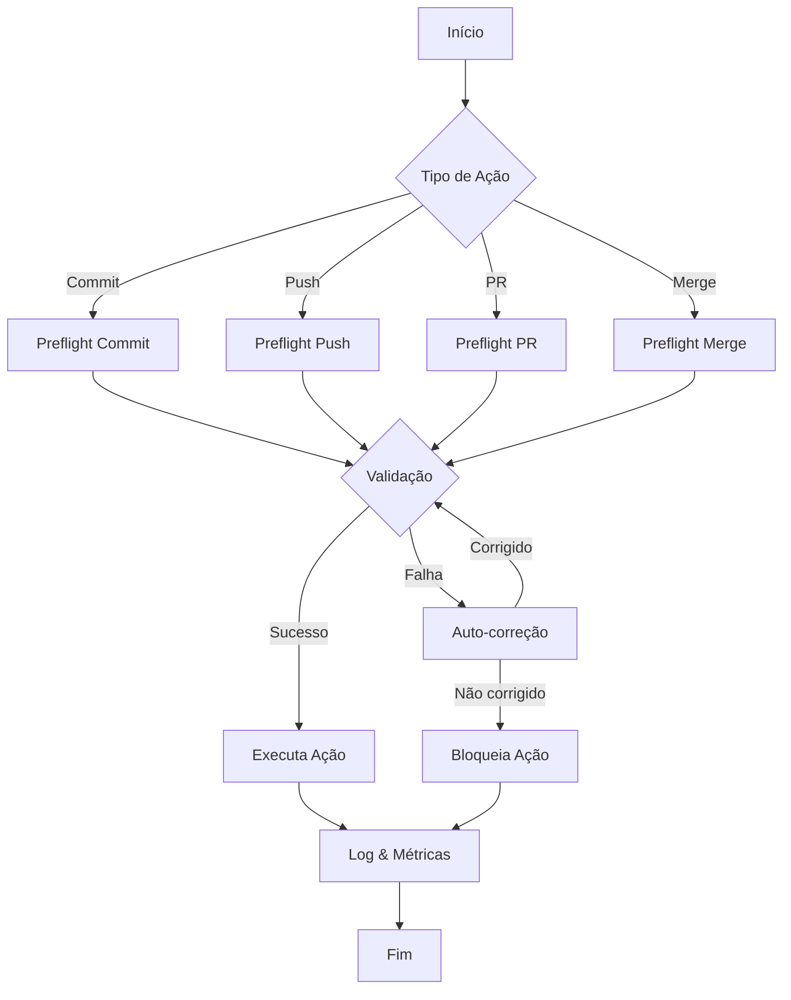
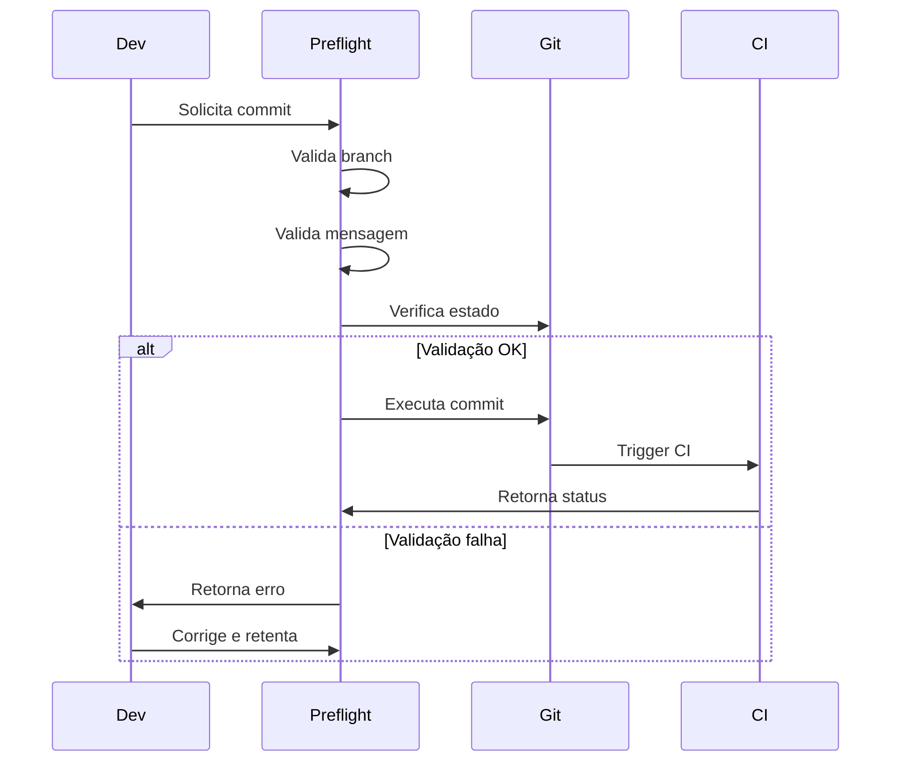
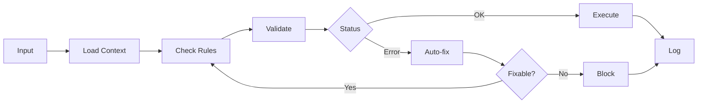
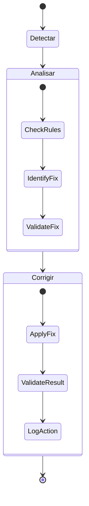
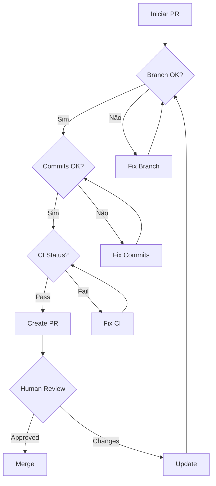
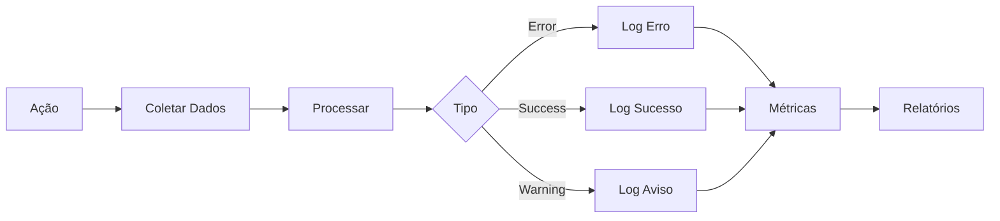
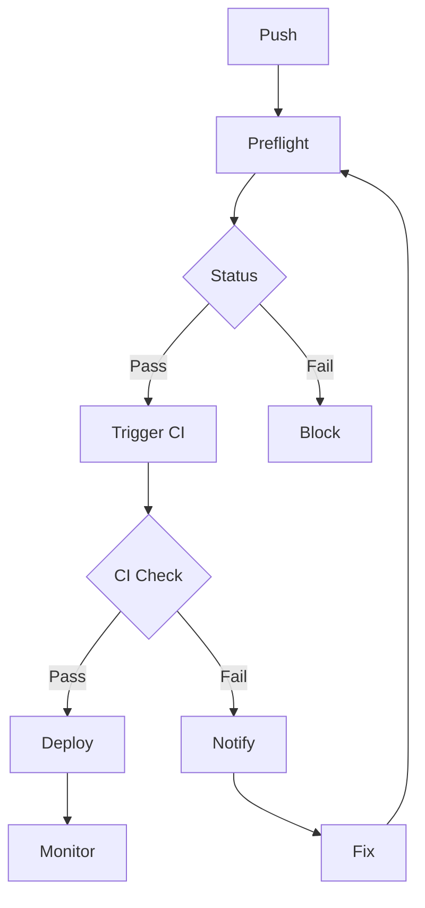
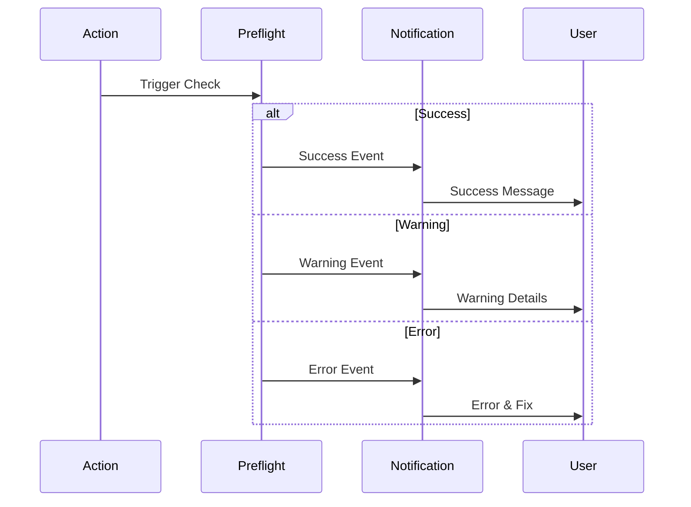
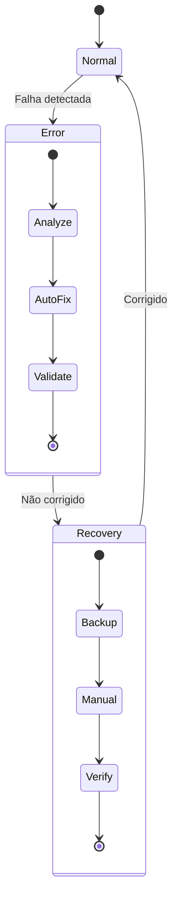

# Diagramas de Fluxo — Preflight Checks

Este documento contém diagramas de fluxo que ilustram os processos do sistema de preflight checks.

## Fluxo Geral do Preflight

## Processo de Commit

## Pipeline de Validação

## Sistema de Auto-correção

## Processo de PR

## Fluxo de Logs e Métricas

## Integração CI/CD

## Sistema de Notificações

## Processo de Recuperação

## Legenda

### Símbolos

- 🟢 Sucesso
- 🟡 Aviso
- 🔴 Erro
- ⚙️ Processamento
- 📝 Log
- 👤 Usuário
- 🤖 Automação

### Estados

- **Normal**: Operação padrão
- **Warning**: Requer atenção
- **Error**: Bloqueante
- **Recovery**: Processo de correção

### Ações

- **Validate**: Verifica conformidade
- **Auto-fix**: Correção automática
- **Block**: Impede progresso
- **Log**: Registra evento