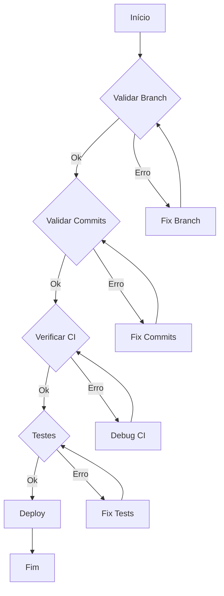
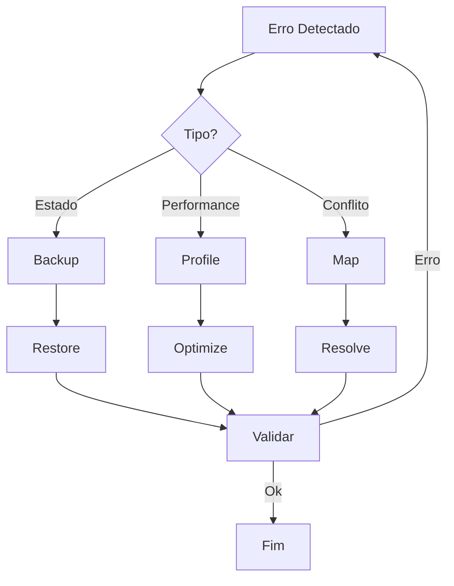
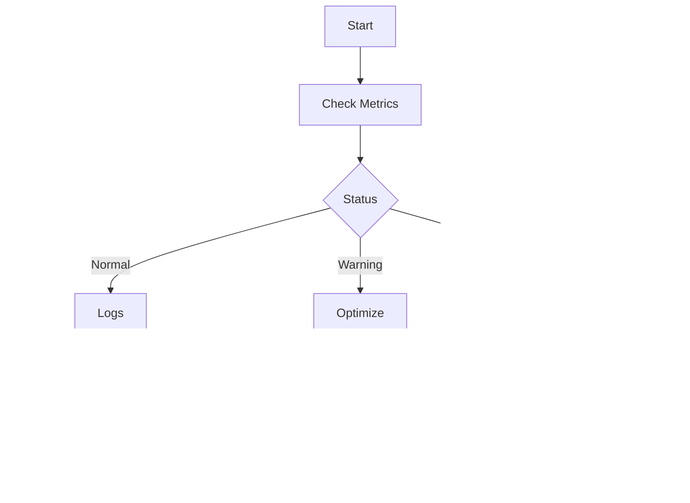
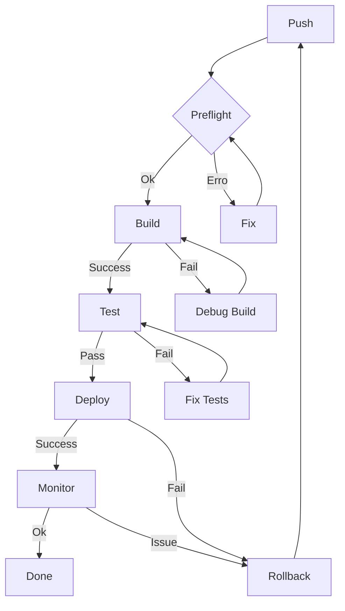
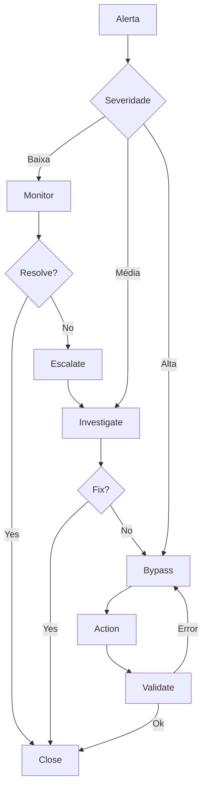
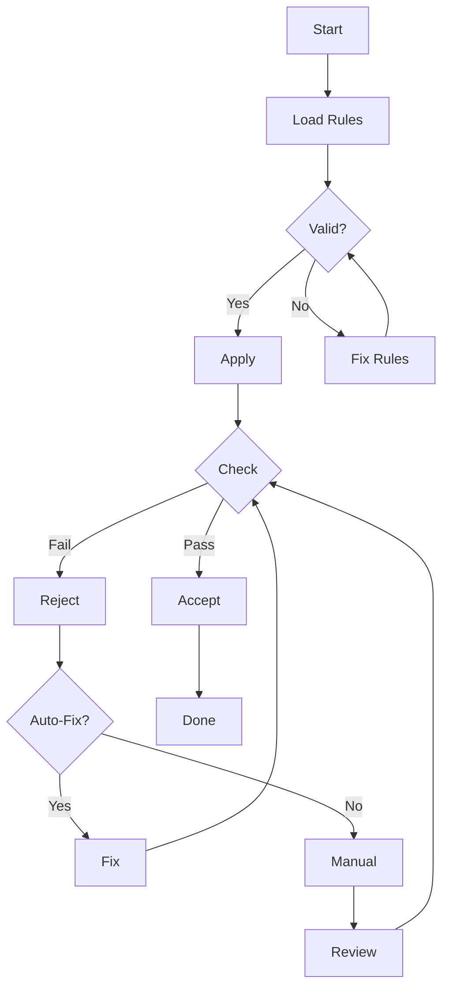

# Diagramas de Fluxo — Preflight

## Fluxo Principal

```mermaid
graph TD
    A[Início] --> B{Validar Branch}
    B -->|Ok| C{Validar Commits}
    B -->|Erro| B1[Fix Branch]
    B1 --> B
    
    C -->|Ok| D{Verificar CI}
    C -->|Erro| C1[Fix Commits]
    C1 --> C
    
    D -->|Ok| E{Testes}
    D -->|Erro| D1[Debug CI]
    D1 --> D
    
    E -->|Ok| F[Deploy]
    E -->|Erro| E1[Fix Tests]
    E1 --> E
    
    F --> G[Fim]
```

## Fluxo de Recovery

```mermaid
graph TD
    A[Erro Detectado] --> B{Tipo?}
    
    B -->|Estado| C[Backup]
    B -->|Performance| D[Profile]
    B -->|Conflito| E[Map]
    
    C --> C1[Restore]
    D --> D1[Optimize]
    E --> E1[Resolve]
    
    C1 --> F[Validar]
    D1 --> F
    E1 --> F
    
    F -->|Ok| G[Fim]
    F -->|Erro| A
```

## Fluxo de Manutenção

```mermaid
graph TD
    A[Start] --> B[Check Metrics]
    
    B --> C{Status}
    C -->|Normal| D[Logs]
    C -->|Warning| E[Optimize]
    C -->|Critical| F[Emergency]
    
    D --> D1[Rotate]
    D --> D2[Compress]
    
    E --> E1[Cache]
    E --> E2[Index]
    
    F --> F1[Bypass]
    F --> F2[Fix]
    
    D1 --> G[End]
    D2 --> G
    E1 --> G
    E2 --> G
    F1 --> G
    F2 --> G
```

## Fluxo de CI/CD

```mermaid
graph TD
    A[Push] --> B{Preflight}
    
    B -->|Ok| C[Build]
    B -->|Erro| B1[Fix]
    B1 --> B
    
    C -->|Success| D[Test]
    C -->|Fail| C1[Debug Build]
    C1 --> C
    
    D -->|Pass| E[Deploy]
    D -->|Fail| D1[Fix Tests]
    D1 --> D
    
    E -->|Success| F[Monitor]
    E -->|Fail| E1[Rollback]
    E1 --> A
    
    F -->|Ok| G[Done]
    F -->|Issue| E1
```

## Fluxo de Emergência

```mermaid
graph TD
    A[Alerta] --> B{Severidade}
    
    B -->|Baixa| C[Monitor]
    B -->|Média| D[Investigate]
    B -->|Alta| E[Bypass]
    
    C --> C1{Resolve?}
    D --> D1{Fix?}
    E --> E1[Action]
    
    C1 -->|Yes| F[Close]
    C1 -->|No| G[Escalate]
    
    D1 -->|Yes| F
    D1 -->|No| E
    
    E1 --> H[Validate]
    G --> D
    
    H -->|Ok| F
    H -->|Error| E
```

## Fluxo de Validação

```mermaid
graph TD
    A[Start] --> B[Load Rules]
    
    B --> C{Valid?}
    
    C -->|Yes| D[Apply]
    C -->|No| C1[Fix Rules]
    C1 --> C
    
    D --> E{Check}
    
    E -->|Pass| F[Accept]
    E -->|Fail| G[Reject]
    
    G --> H{Auto-Fix?}
    
    H -->|Yes| I[Fix]
    H -->|No| J[Manual]
    
    I --> E
    J --> K[Review]
    K --> E
    
    F --> L[Done]
```