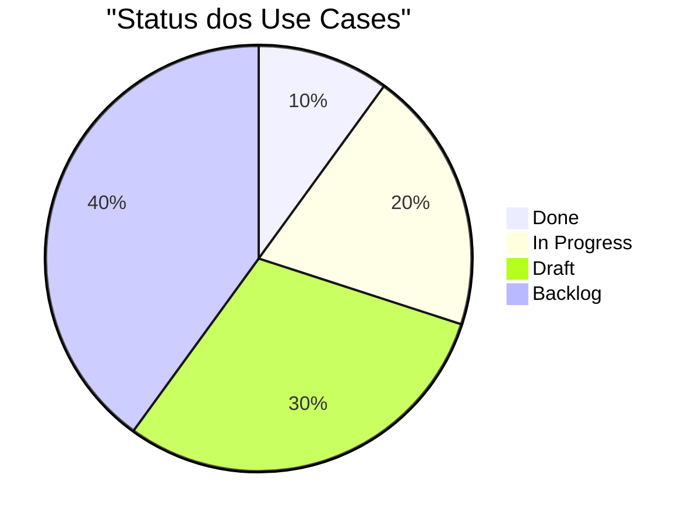

# Use Cases — Code Brain AI

## Visão Geral

Este diretório contém os casos de uso (use cases) do sistema, documentando os fluxos de interação, requisitos e critérios de aceitação de cada funcionalidade.

## Estrutura

```
usecases/
├── README.md           # Este arquivo
├── template.md         # Template base para novos use cases
├── schema.yaml         # Schema de validação
├── validate-usecase.sh # Script de validação
└── UC-XXX/            # Use cases individuais
    ├── UC-001.md
    ├── UC-002.md
    └── ...
```

## Padrões e Convenções

### 1. Identificação

- Todo use case deve ter um ID único no formato `UC-XXX`
- A numeração deve ser sequencial, começando em 001
- O arquivo deve ser nomeado exatamente como o ID

### 2. Estrutura do Documento

Cada use case deve seguir a estrutura definida no `template.md`:

1. **Metadata**: Informações básicas do use case
2. **Descrição**: Objetivo e contexto
3. **Atores**: Envolvidos no processo
4. **Pré-condições**: Requisitos iniciais
5. **Fluxos**: Principal, alternativos e exceções
6. **Pós-condições**: Estado final esperado
7. **Requisitos**: Especificações técnicas
8. **Critérios**: Critérios de aceitação
9. **Informações**: Dados complementares

### 3. Diagramas

- Use diagramas Mermaid para visualizar fluxos
- Mantenha diagramas simples e focados
- Inclua legendas explicativas

### 4. Critérios de Aceitação

- Use formato Gherkin (Dado/Quando/Então)
- Seja específico e mensurável
- Inclua tanto casos positivos quanto negativos

## Processo de Criação

### 1. Iniciar Novo Use Case

```bash
# Criar novo use case a partir do template
cp template.md UC-XXX.md

# Atualizar metadata
# - ID
# - Título
# - Datas
# - Stakeholders
```

### 2. Desenvolver Conteúdo

1. Preencher descrição e objetivo
2. Identificar atores e pré-condições
3. Documentar fluxo principal
4. Adicionar fluxos alternativos
5. Definir critérios de aceitação

### 3. Validar Documento

```bash
# Validar estrutura e conteúdo
./validate-usecase.sh UC-XXX.md

# Corrigir problemas identificados
# Revalidar até passar todos os checks
```

### 4. Review e Aprovação

1. Submeter para revisão
2. Incorporar feedback
3. Obter aprovações necessárias
4. Atualizar status para "approved"

## Manutenção

### 1. Atualizações

- Mantenha o histórico de revisões atualizado
- Documente mudanças significativas
- Atualize diagramas quando necessário

### 2. Validação Contínua

```bash
# Validar todos os use cases
./validate-usecase.sh

# Verificar problemas comuns
# - Links quebrados
# - Diagramas inválidos
# - Estrutura inconsistente
```

### 3. Boas Práticas

1. **Clareza**
   - Use linguagem simples e direta
   - Evite jargões desnecessários
   - Mantenha parágrafos concisos

2. **Completude**
   - Cubra todos os cenários relevantes
   - Documente exceções importantes
   - Inclua exemplos quando útil

3. **Consistência**
   - Siga o template consistentemente
   - Use terminologia padronizada
   - Mantenha formatação uniforme

## Status dos Use Cases

| ID     | Título | Status | Última Atualização |
|--------|--------|--------|-------------------|
| UC-002 | ...    | Draft  | 2025-11-08       |

## Métricas



## Links Úteis

- [Template de Use Case](./template.md)
- [Schema de Validação](./schema.yaml)
- [Script de Validação](./validate-usecase.sh)
- [Guia de Contribuição](../CONTRIBUTING.md)